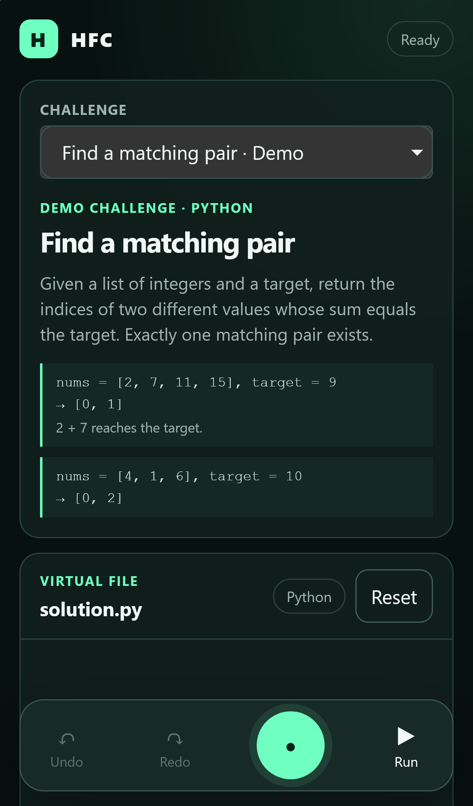
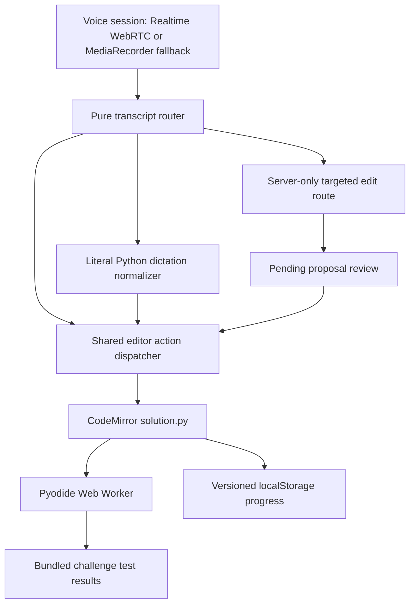

# Hands-Free Code

Hands-Free Code (HFC) is a working mobile-first Python practice playground for a
focused voice-coding workflow. Speak constrained editor commands, literal Python
dictation, or a targeted AI edit request; review every AI proposal before it changes
`solution.py`; then run the challenge's bundled tests in the browser.



## Product boundary

HFC intentionally stays narrow: five bundled Python challenges, one in-memory virtual
file per challenge, deterministic tests, and no accounts, cloud sync, terminal, arbitrary
file access, or server-side code execution. The Pyodide runner is a browser execution environment, not a
security boundary for hostile code. Challenge concepts include common interview exercises,
but the bundled wording and test cases are original rather than copied from another service.

## Architecture



The browser receives only a short-lived Realtime credential. Permanent API credentials,
audio, transcripts, and AI proposals are never written to local storage.

## Quick start

Prerequisites: Node.js 20 or newer and npm.

```bash
npm ci
Copy-Item .env.example .env.local
npm run dev
```

Open <http://localhost:3000>. On macOS or Linux, copy the environment template with
`cp .env.example .env.local` instead.

To use the microphone from an iPhone or another device, open the app through a trusted
`https://` URL. A LAN URL such as `http://192.168.x.x:3000` can render the app, but mobile
browsers do not expose microphone capture on that insecure origin. For local HTTPS,
Next.js supports `npm run dev -- --experimental-https`; the generated certificate must also
be trusted by the phone. A trusted HTTPS deployment or tunnel avoids device-certificate setup.

### Environment variables

Set these in `.env.local`; do not use a `NEXT_PUBLIC_` prefix for secrets.

| Variable | Purpose |
| --- | --- |
| `HFC_AUTH_USERNAME` | Production HTTP Basic Auth username. |
| `HFC_AUTH_PASSWORD` | Production HTTP Basic Auth password. |
| `OPENAI_API_KEY` | Server-only OpenAI key for Realtime credentials and targeted edits. |
| `OPENAI_REALTIME_MODEL` | Optional Realtime model; defaults to `gpt-realtime`. |
| `OPENAI_REALTIME_TRANSCRIPTION_MODEL` | Optional Realtime transcription model. |
| `OPENAI_TRANSCRIPTION_MODEL` | Optional transcription model for the audio fallback. |
| `OPENAI_EDIT_MODEL` | Optional Responses API model for targeted edits. |
| `HFC_EDIT_ADAPTER=mock` | Uses deterministic local edit proposals without an API key. |
| `HFC_VOICE_MODE` | Optional `realtime` or `recording` override; otherwise inferred from the provider key. |
| `OPENROUTER_API_KEY` | Selects the one-utterance MediaRecorder fallback for transcription. |
| `OPENROUTER_TRANSCRIPTION_MODEL` | Optional OpenRouter transcription model for that fallback. |

The OpenRouter fallback is for transcription only. Targeted edits still require an OpenAI
key unless `HFC_EDIT_ADAPTER=mock` is set.

Production builds fail closed with a `503` response when either authentication variable is
missing. Keep both values server-side and use a long, randomly generated password. Local
development remains accessible without credentials.

## Demo script

1. Start on **Contains a duplicate** and tap the microphone.
2. Say “select line 3.”
3. Say “type return len open paren nums close paren not equals len open paren set open paren nums close paren close paren.”
4. Say “run tests,” observe the three named cases pass, then say “stop listening.”

The second primary challenge, **Check an anagram**, is also solvable deterministically: select
line 3, then say “type return sorted open paren s close paren double equals sorted open paren t
close paren.”

Literal dictation starts with “type”; for example, “type return nums open bracket zero close
bracket.” Supported editing commands and the full vocabulary are visible in the app.

## Verification

Run every gate from the repository root:

```bash
npm run typecheck
npm run lint
npm test
npm run build
npm run test:e2e
```

The browser suite uses a 390×844 mobile-WebKit profile plus desktop Chromium. It includes a
mocked WebRTC/AI rehearsal and deterministic transcript-only solutions for both primary
challenges, while the Python worker remains real.

## Dependencies and credits

HFC uses [Next.js](https://nextjs.org/), [React](https://react.dev/),
[CodeMirror](https://codemirror.net/), [Pyodide](https://pyodide.org/),
[OpenAI's JavaScript API](https://platform.openai.com/docs/),
[Vitest](https://vitest.dev/), and [Playwright](https://playwright.dev/). See
`package.json` and `package-lock.json` for the complete, pinned dependency graph.

## Limitations and device verification

- A physical iPhone Safari rehearsal is still required before presenting the final demo:
  install the PWA, verify standalone safe-area layout, and complete the script three times
  without the software keyboard. Automated WebKit is not a substitute.
- The `MediaRecorder` fallback records one utterance at a time and can have high, variable
  transcription latency. It automatically re-arms after a non-Stop completed turn.
- Pyodide has a cold-start cost. Runs are isolated in a worker and are limited to three
  seconds; a timeout recreates the worker.
- AI edits are targeted replacement proposals, never automatic document mutations. A
  collapsed `change` selection is rejected locally.

## License

MIT. See [LICENSE](LICENSE).
